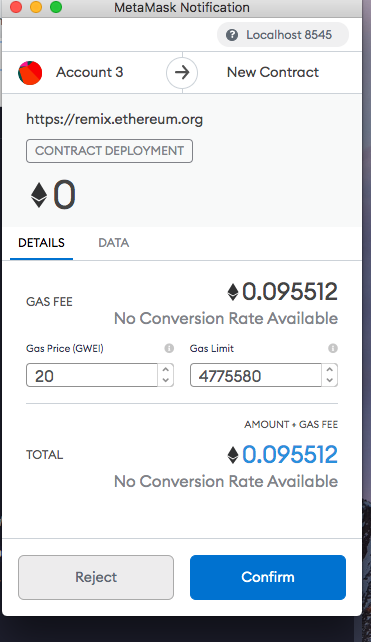

# Pupper Coin Crowdsale

## Pupper Coin
Using solidity I created a coin named Pupper Coin to be deployed in a crowd sale to raise ether.  Pupper Coin is a standard ERC-20 token that was created using ERC20, ERC20Detailed, and ERC20Mintable Open Zeppelin libraries to add different functionality

## Crowdsale
The crowd sale was created using the Open Zepplin libraries Crowdsale, MintedCrowdsale (allows tokens to be created at purchase), CappedCrowdsale (sets a limit on the amount a purchaser can buy), TimedCrowdsale(sets a time limit on the crowdsale), and RefundablePostDeliveryCrowdsale(allows for refunds).
The PupperCoinSale paramaters and values were set as following:
* Rate = 1 (1 ether = 1 PUP)
* Wallet = owner of contracts wallet address
* Token = PupperCoin
* Goal = 300 ETH
* Cap = 150 ETH
* Open Time = date and time of launch
* Close Time = 24 weeks after launch

These paramaters were created within the constructor of the PupperCoinSale contract.

## Deploying Pupper Coin

After creating the Crowdsale I created a deployer which allowed both the Crowdsale and the Pupper Coin to deploy through a single contract.

Using the deployer in Remix I deployed the PupperCoinSaleDeployer and paid the gas fee using the wallet address of the owner of the contract who will the beneficiary of the Ether raised.

Once the contract was deployed the next step was to deploy the Pupper Coin and Crowdslae contracts using the addresses

Now that the contracts have been deployed the they are available for users to purchase the Pupper Coin.  To do so the CrowdSale contract is used by inputting the buyers wallet address and adding the owners wallet as the beneficiary.

In this case this buyer is purchasing 70 ETH worth a Pupper Coin.

The beneficiary's wallet is added into salethe buy token funtion to transact

Finally the transaction is confirmed through the buyers MetaMask Wallet

Now that the user has the Pupper Coin. They can add the Pupper Coin contract address into there wallet to view the assets they have purchased
